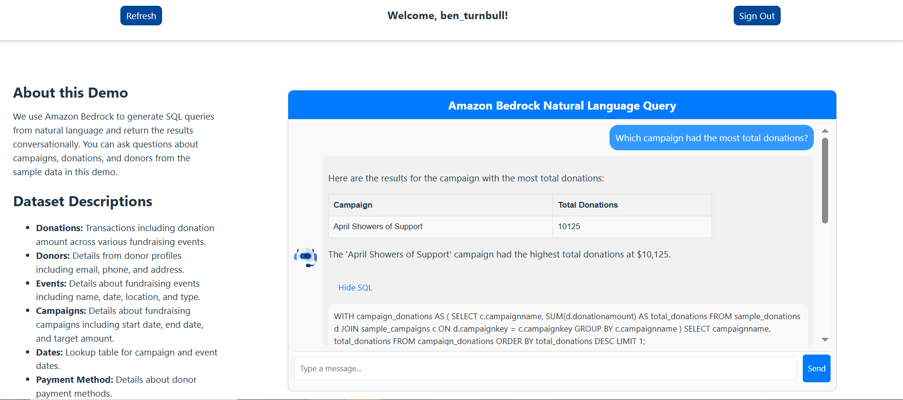

# Natural Language Query with Amazon Bedrock (React SPA App)

## Overview

This sample shows how to make a React SPA application with AWS Cloud Development Kit (CDK) that hosts a chatbot for natural language query. 

Screenshots of this demo are shown below.




## Architecture

There are four cdk stacks:

- AuthStack
  - Amazon Cognito
- DataStack
  - Amazon S3 bucket, Amazon DynamoDB, AWS Glue Crawlers, Amazon Athena
- APIStack
  - Amazon API Gateway, AWS WAF, AWS Lambda
- FrontendStack
  - Amazon CloudFront, AWS WAF, Amazon S3


1. AWS Glue crawls the data stores and adds schema and table metadata to the Glue data catalog. 

2. The user is authenticated via Amazon Cognito. 

3. The client fetches the static, single page application (SPA) hosted in S3. Client IPs are validated by the WAF. 

4. The user submits a question through the React user interface.  

5. The Cognito session authorizes a POST call to API Gateway. The WAF uses the standard ruleset to evaluate the traffic. 

6. AWS Lambda receives the API gateway event and orchestrates the backend. 

7. The conversation history is pulled from DynamoDB as context. 

8. Amazon Bedrock uses the metadata from the data store + the user’s question as context to generate a SQL query. The SQL query is tested. If an error occurs, the LLM generates a new query and tests again. This retry loop can occur up to 3 times. 

9. The generated SQL query is executed with Amazon Athena against the original data store. 

10. The SQL query result is returned to Amazon Bedrock and is used as context to generate a conversational response to the user’s query. 

11. The response is submitted through the front-end to the user. 


## Directory Structures

```sh
.
├── backend          # CDK scripts for backend resources
└── frontend
    ├── provisioning # CDK scripts for frontend resources
    └── web          # React scripts
```

## Main Libraries

- @aws-amplify/ui-components
- @aws-amplify/ui-react
- aws-amplify
- aws-cdk
- aws-lambda
- jest
- react
- react-scripts
- ts-node
- typescript

# Deploying the solution

## Prerequisites

- npm
- cdk
- configuration of aws profile

## Getting started

### 1. Enable Amazon Bedrock model access 

- Navigate to the Amazon Bedrock console and select `Model Access` at the bottom of the left navigation pane. 
- Select `Enable specific model access` or `Modify model access` if you've visited this setting before.
- Check the `Claude 3 Sonnet` model under the Anthropic header. We'll use this model to generate SQL queries and return results in natural language. You are welcome to swap in an Amazon Bedrock model of your choice in the environment variables of the API's Lambda function. 
- Select `Next` and choose `Submit`. 

### 2. Clone the repository

- Run `git clone` command to download the source code

### 3. Deploy backend resources

- Run `npm install` command in the [backend](backend) directory.
- Run `cdk deploy --all` to deploy backend resouces.
  - You can deploy each stack individually like `cdk deploy AuthStack`.
- When resouces are successfully deployed, outputs such as APIStack.CognitoUserPoolId will be shown in the terminal. These values will be used to deploy frontend resouces.

```sh
Outputs:
APIStack.CognitoUserPoolId = xxx
APIStack.CognitoUserPoolWebClientId = xxx
APIStack.ExportsOutputFnGetAttUserPoolxxx = xxx
...
Outputs:
AuthStack.apiEndpointxxx = xxx
```

### 4. Deploy frontend resources

#### 4.1 Build React app

- Run `npm install` command in the [frontend/web](frontend/web) directory.
- This React app uses environment variables to manage configuration settings. Follow these steps to set up your environment file:

  - In the [frontend/web](frontend/web) directory, create a new file named `.env`.
  
  - Open the `.env` file in your text editor.
  
  - Add your environment variables in the following format:
   ```sh
   # .env
   VITE_CLIENT_ID={Insert Cognito client ID from your AuthStack output}
   VITE_USER_POOL_ID={Insert Cognito user pool ID from your AuthStack output}
   VITE_API_ENDPOINT = {Insert API endpoint from your APIStack output}
   ```

- Run `npm run build` in the same directory to build react scripts.

#### 4.2 Deploy frontend resources

- Move to [frontend/provisioning](frontend/provisioning) directory and run `npm install` command.
- Run `cdk deploy --all` to deploy frontend resouces.
- When resouces are successfully deployed, FrontendStack.endpoint will be displayed in the terminal. You will access the app hosted on cloudfront/s3 by this url.

```sh
Outputs:
FrontendStack.endpoint = xxx.cloudfront.net
```

### 5. Create Cognito user

- In order to sign in the app, you need to create a new cognito user. You can create a user by AWS Management Console or AWS CLI.


## Experimenting with the Chatbot

The sample dataset follows a dimensional model of synthetic donor data. Donation transactions are stored in a central fact table with auxillary information like donors, events, campaigns and payment method stored in dimension tables. 


## Security

### Restrict Access by IP
cdk.json lists the specific IPs to restrict API access to your API Gateway through the AWS Web Application Firewall (WAF). By default the WAF allows all IPv4 traffic. Updates these IPs if neccesary. 

## Testing

We use the Jest framework to build test cases for this CDK. 

To run backend tests, simply run `npm test` to execute the test scripts in the [backend/test](backend/test) directory. By default, the test script checks a simple synthesis for each CDK stack Update this test script if neccesary. 

## Troubleshooting

### API Gateway timeouts
Given the retry loop design, some queries may take longer than the 29 second API Gateway timeout setting to return a result. You may wish to increase the API Gateway timeout by updating the service quota titled `Maximum integration timeout in milliseconds`.  


See [CONTRIBUTING](CONTRIBUTING.md#security-issue-notifications) for more information.

## License

This library is licensed under the MIT-0 License. See the LICENSE file.
